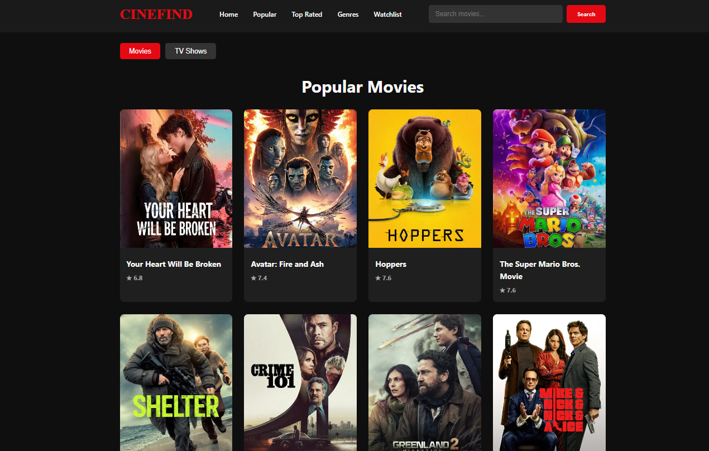
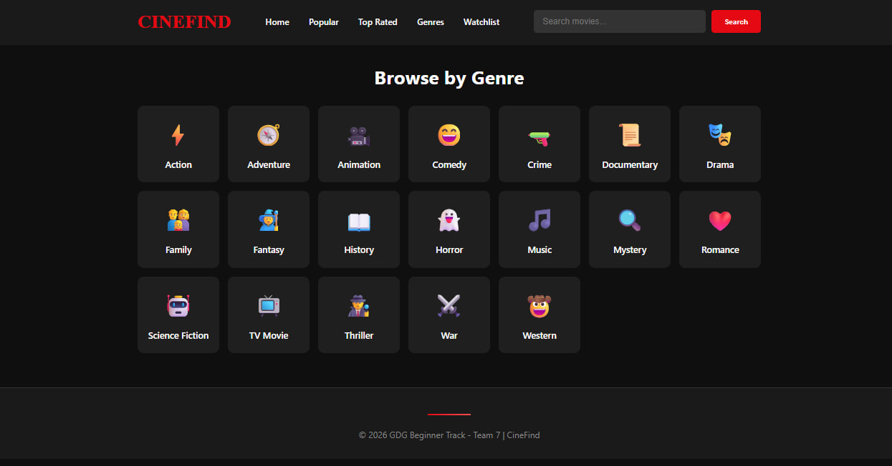
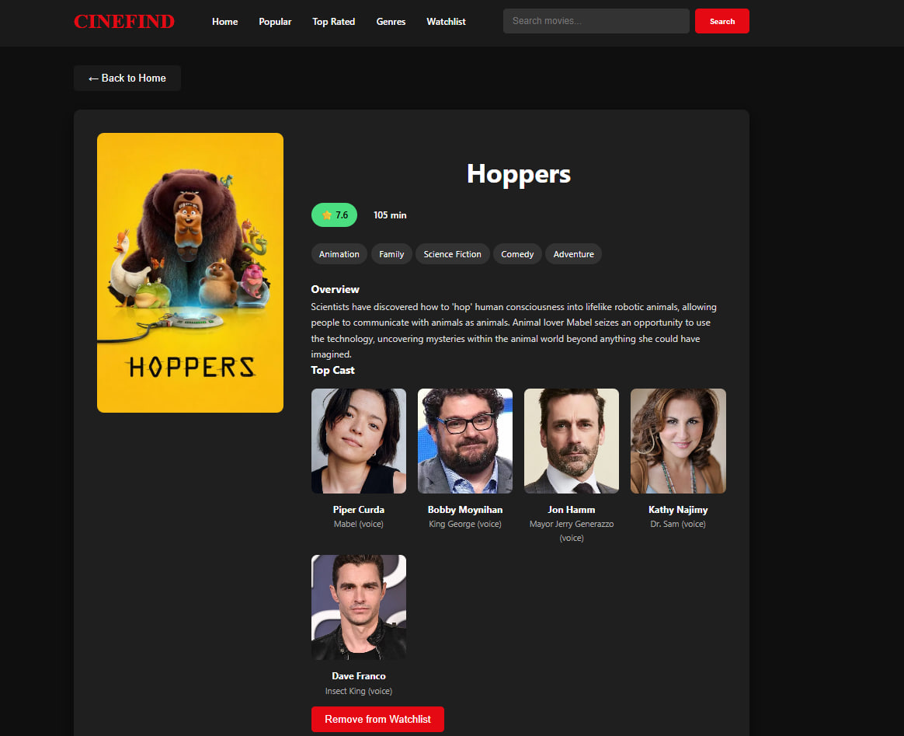

🎬 Movie Watchlist

A modern and responsive movie watchlist web application built using HTML5, CSS3, and JavaScript. The application allows users to discover movies through the TMDB API, explore detailed movie information, and save their favorite titles to a personalized watchlist. All watchlist data is stored locally using LocalStorage, ensuring persistence even after refreshing or reopening the browser.

Designed with a clean UI and smooth user experience, the project demonstrates practical front-end development concepts including API integration, dynamic rendering, responsive layouts, and browser storage management.

✨ Features
🔍 Search movies instantly using the TMDB API
🎞 Browse trending and categorized movies
❤️ Add and manage movies in a personal watchlist
💾 Persistent browser storage using LocalStorage
📄 Dedicated movie detail page with additional information
📱 Fully responsive design for desktop, tablet, and mobile
⚡ Fast and interactive user experience
🎨 Clean and minimal interface with modern styling
🛠 Technologies Used
HTML5 — Structure and semantic layout
CSS3 — Styling, animations, and responsive design
JavaScript (ES6) — Application logic and dynamic rendering
TMDB API — Movie database and search functionality
LocalStorage API — Persistent client-side data storage
🚀 How to Run the Project
Clone or download the repository
Open the project folder
Launch index.html using:
Live Server (recommended)
or any modern browser

⚠️ Internet connection is required for TMDB API requests.

📂 Project Structure
movie-watchlist/
│
├── index.html          # Main homepage
├── details.html        # Movie details page
├── style.css           # Main stylesheet
├── script.js           # Main JavaScript logic
├── assets/             # Images and screenshots
└── README.md           # Project documentation
👥 Team Members & Responsibilities
Responsibility	Team Member
Lead Architect & API Integration	Mikiyas Aschalew
UI/UX Design & Responsive Layout	Betelhem Sefiw Mulu
Search Functionality & Categories	Edilawit Legesse
Movie Detail Page Development	Biruk Molla
Watchlist & LocalStorage Logic	Bethlehem Eshisu
HTML Structure & Components	Melat Endalamaw
Navigation & User Flow	Seble Sisay
Project Coordination & Documentation	Makbel Nega Asrie
🧪 Testing & Validation

The application was tested to ensure:

✅ Watchlist data persists after browser refresh
✅ Responsive layouts work across multiple screen sizes
✅ Smooth page navigation and movie rendering
✅ API requests fetch movie data correctly
✅ Compatibility with modern browsers such as Chrome and Edge
📈 Future Improvements
🌙 Dark / Light mode toggle
🗑 Remove movies from watchlist
✏️ Edit and organize watchlist entries
⭐ Movie ratings and reviews
🔃 Sorting and advanced filtering
👤 User authentication and cloud sync
🎬 Trailer integration using YouTube API
📚 Learning Outcomes

This project helped the team gain practical experience in:

REST API integration
Dynamic DOM manipulation
Responsive web design
LocalStorage management
Front-end collaboration and project structuring
Team-based software development workflow
📄 Conclusion

Movie Watchlist is a lightweight yet functional web application that combines movie discovery with personalized organization. The project showcases the effective use of front-end technologies and demonstrates how APIs and browser storage can be integrated to create a seamless user experience. With future enhancements, the platform can evolve into a more advanced and feature-rich movie management application.
